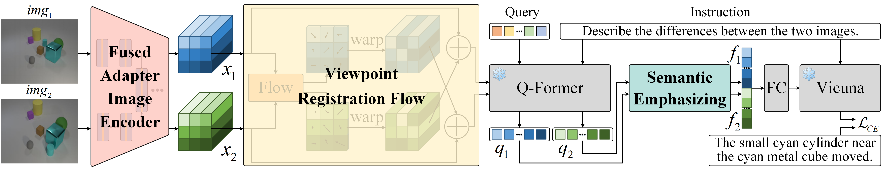

# Viewpoint Integration and Registration with Vision Language Foundation Model for Image Change Understanding
Xiaonan Lu, Jianlong Yuan*, Ruigang Niu, Yuan Hu, Fan Wang

**DAMO Academy, Alibaba Group**

Paper: [Viewpoint Integration and Registration with Vision Language Foundation Model for Image Change Understanding](https://arxiv.org/abs/2309.08585)


## Overview
- VIR-VLFM is the first attempt to enhance the multi-image understanding ability of vision language foundation models, enabling them to be applied to image change understanding.
- In VIR-VLFM, a fused adapter image encoder is devised to bridge the gap between image encoder pre-training and ICU. Besides, a viewpoint registration flow and a semantic emphasizing module are designed to reduce the severe performance degradation caused by viewpoint variations.
- Extensive experiments on CLEVR-Change and Spot-the-Diff illustrate that our method achieves state-of-the-art performance in image change caption on all metrics and shows promising results in change question answering.




## Getting Started
### Installation

**1. Prepare the code and the environment**

Git clone our repository and creat a python environment

```bash
git clone https://github.com/lxn96/VIR-VLFM
cd VIR-VLFM
conda env create -f environment.yml
conda activate vir_vlfm
```

**2. Prepare Vicuna weights**

Please refer to [instruction](PrepareVicuna.md) to prepare the Vicuna-7B weights.
The structure is as follows:

```
vicuna_weights_7b
├── config.json
├── generation_config.json
├── pytorch_model.bin.index.json
├── pytorch_model-00001-of-00002.bin
...   
```

Then, set the path to the vicuna weight in the [model config file](vir_vlfm/configs/models/vir_vlfm.yaml#L15) at Line 15.

**3. Prepare minigpt4 pretrained weights for llama projection layer**

Download the [pretrained checkpoints](https://drive.google.com/file/d/1RY9jV0dyqLX-o38LrumkKRh6Jtaop58R/view?usp=sharing). Then, set the path to the pretrained checkpoint in the [training config file](train_configs/vir_vlfm_clevr_change.yaml#L13) at Line 13 for training.


**4. Prepare the checkpoint for VIR-VLFM on CLEVR-Change**

Download the checkpoint for [VIR-VLFM](https://drive.google.com/file/d/13Mv3Nh9q3mKCn5z95xWnKWuloe-Wi6al/view?usp=sharing). Then, set the path to the pretrained checkpoint in the [evaluation config file](eval_configs/vir_vlfm_eval.yaml#L14) at Line 14 for evaluation.


### Evaluation

For evaluation, run [test.py](test.py) as follows:

```
python test.py --img1 test_images/image1_1.png --img2 test_images/image1_2.png --cfg-path eval_configs/vir_vlfm_eval.yaml  --gpu-id 0
```


### Training

For training, first prepare the [CLEVR-Change](https://github.com/Seth-Park/RobustChangeCaptioning) dataset. Then, set the path to the pretrained checkpoint in the [dataset config file](vir_vlfm/configs/datasets/clevr_change/align.yaml). The structure of CLEVR-Change dataset is as follows:

```
dataset
├── clevr_change
    ├── images
    ├── nsc_images
    ├── sc_images
    ├── splits.json
    ├── change_captions.json
    ├── no_change_captions.json
    ...   
```

And run [train.py](train.py) with [training config file](train_configs/vir_vlfm_clevr_change.yaml) as follows:

```bash
torchrun --nproc-per-node NUM_GPU train.py --cfg-path train_configs/vir_vlfm_clevr_change.yaml
```


## Acknowledgement

+ [BLIP-2](https://huggingface.co/docs/transformers/main/model_doc/blip-2) The model architecture of our VIR-VLFM follows BLIP-2.
+ [Vicuna](https://github.com/lm-sys/FastChat) The large-scale language model applied in our VIR-VLFM is Vicuna-7B.
+ [MiniGPT-4](https://github.com/Vision-CAIR/MiniGPT-4) This repository is built upon minigpt4.

## Citation
If you're using VIR-VLFM in your research or applications, please cite using this BibTeX:
```bibtex
@article{lu2023viewpoint,
  title={Viewpoint Integration and Registration with Vision Language Foundation Model for Image Change Understanding},
  author={Lu, Xiaonan and Yuan, Jianlong and Niu, Ruigang and Hu, Yuan and Wang, Fan},
  journal={arXiv preprint arXiv:2309.08585},
  year={2023}
}
```
